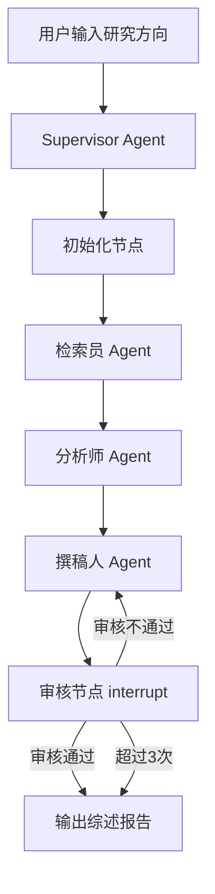

# 📚 Multi-Agent 学术文献综述系统

> **输入一个研究方向，自动检索文献、对比方法、识别研究空白，生成带规范引用的文献综述报告。**

基于 LangGraph 构建的多智能体协作系统，由检索员、分析师、撰稿人三个专业 Agent 分工协作，配合 Supervisor 编排调度，自动完成从学术文献检索、方法分析对比到综述报告生成的全流程。

## ✨ 核心亮点

- 🔄 **多智能体协作流水线** — Supervisor-Worker 架构，检索 → 分析 → 撰稿全自动化
- 📚 **学术检索为主** — ArXiv 论文检索 + PDF 全文提取为主，Tavily 网络补充（研究团队 / 开源项目 / 基准数据集）
- 🧭 **综述式分析** — 方法分类、性能对比、发展脉络、研究空白识别
- 📝 **规范引用与防编造** — 端到端引用追踪，正文 [1] [2] 标注 + 参考文献列表，提示词层面禁止编造文献
- 🔁 **自修正闭环** — 审核不通过自动返工补充，最多 3 次迭代优化
- 📊 **Agent 驱动可视化** — 分析师自主调用 matplotlib 生成对比图表并嵌入报告
- 🧠 **RAG 检索增强** — ChromaDB 向量库分块存储文献片段，按需检索最相关内容，抑制幻觉
- 🤖 **模型自选** — 服务端白名单配置可选模型（DeepSeek / Qwen / GPT 等任意 OpenAI 兼容接口），前端下拉切换
- 💾 **状态持久化 + 断点恢复** — SqliteSaver Checkpointer，服务重启任务不丢
- 👤 **Human-in-the-Loop** — LangGraph interrupt 机制实现人工审核节点
- 📡 **SSE 实时进度推送** — 任务阶段、LLM Token 流实时可见
- 🖥️ **Streamlit 前端 + 一键部署** — `deploy/install.sh` 支持 Ubuntu 服务器自动化部署
- 🧪 **89 项自动化测试** — 单元 + 集成测试全覆盖，全部 mock 无需 API Key

---

## 🏗️ 系统架构



**数据流：**

```
用户输入 → init → searcher → analyst → writer → reviewer ─┬→ END（审核通过 / 超过重试上限）
                                                            └→ writer（审核不通过，自修正闭环）
```

| 节点 | 角色 | 职责 |
|------|------|------|
| `init` | 初始化 | 设置研究方向、初始化状态字段 |
| `searcher` | 检索员 | **ArXiv 学术检索为主**（高引综述、里程碑工作、SOTA 方法、基准数据集论文），Tavily 辅助收集研究团队、开源项目、顶会信息；LLM 通过 Function Calling 自主决策检索策略 |
| `analyst` | 分析师 | 从文献中提取**方法分类、性能对比、发展脉络、代表性团队、挑战与研究空白**；自主调用 matplotlib 生成对比图表 |
| `writer` | 撰稿人 | 整合分析结果，生成结构规范的**文献综述报告**（Markdown），正文 [1] [2] 引用标注，末尾参考文献列表 |
| `reviewer` | 审核节点 | 通过 `interrupt()` 暂停，等待人工审核反馈 |

---

## 🛠️ 技术栈

| 组件 | 技术 | 用途 |
|------|------|------|
| 多智能体框架 | LangGraph + LangChain | 构建 StateGraph，管理 Agent 协作流程 |
| LLM 引擎 | OpenAI 兼容 API（GPT / DeepSeek / Qwen 等） | 各 Agent 的推理与内容生成 |
| Web 框架 | FastAPI | RESTful API + SSE 流式推送 |
| 前端界面 | Streamlit | 交互式演示界面 |
| 学术检索 | ArXiv (Python arxiv 库) | 论文检索 + PDF 全文提取（PyMuPDF） |
| 网络补充检索 | Tavily API | 研究团队、开源项目、基准数据集信息 |
| 数据可视化 | matplotlib + numpy | Agent 驱动的对比图表生成 |
| 向量数据库 | ChromaDB | RAG 架构，文献分块存储与相似度检索 |
| 状态持久化 | AsyncSqliteSaver | Checkpointer 实现断点恢复 |
| 配置管理 | Pydantic Settings + python-dotenv | 环境变量与模型白名单配置 |
| 测试框架 | pytest + pytest-asyncio | 89 个单元 + 集成测试，全部 mock 无需 API Key |

---

## 📖 核心功能详解

### Supervisor-Worker 架构

基于 LangGraph `StateGraph` 构建流水线，Supervisor 通过条件边（`should_continue_or_end`）控制路由：审核通过输出报告，不通过携带反馈回到撰稿人返工。

### 综述报告结构

撰稿人生成的报告遵循学术综述的章节规范：

1. **摘要（Abstract）** — 综述范围、方法脉络与核心结论
2. **引言（Introduction）** — 研究背景、综述范围界定、文献来源说明
3. **研究现状与分类（Taxonomy）** — 按方法/技术路线分类梳理现有工作
4. **方法对比与分析（Comparison）** — 表格对比性能指标与优缺点
5. **挑战与研究空白（Challenges & Gaps）** — 现有工作局限与未解决问题
6. **总结与展望（Conclusion）** — 发展趋势与未来方向
7. **参考文献（References）** — 完整引用列表

### 引用管理与防编造

- 检索员为每条文献/资料分配唯一引用编号，全流程传递
- 正文所有论断使用 [1] [2] 标注，可溯源
- 分析师 JSON 输出逐条带引用，撰稿人提示词**硬性要求不得编造不存在的文献**
- 对相互矛盾的文献结论，并列呈现不同观点，区分"共识"与"争议"

### 模型自选（用户可自定义研究模型）

服务端通过白名单开放模型选择，密钥与接口地址不出服务端：

```env
# .env — 开放自选（不配置则功能关闭，前端隐藏选择框）
AVAILABLE_MODELS=deepseek-chat,qwen-plus,gpt-4o

# 每个模型可用专属变量覆盖密钥/接口地址（变量名 = 模型名特殊字符转下划线大写）
DEEPSEEK_CHAT_API_KEY=sk-xxx
DEEPSEEK_CHAT_BASE_URL=https://api.deepseek.com/v1
QWEN_PLUS_API_KEY=sk-yyy
QWEN_PLUS_BASE_URL=https://dashscope.aliyuncs.com/compatible-mode/v1
# 未配置专属变量的模型沿用全局 OPENAI_API_KEY / OPENAI_BASE_URL
```

- `GET /api/models` 返回白名单与默认模型，前端自动渲染下拉框
- 提交任务携带 `model_name`，服务端校验白名单（未预置的模型返回 400）
- `model_name` 经 AgentState 透传，三个 Agent 按 `resolve_llm_config()` 动态构造 LLM；审核返工时继续沿用用户所选模型

### 自修正闭环（Human-in-the-Loop）

审核节点通过 `interrupt()` 暂停图执行：审核通过输出最终报告；提交修改意见则携带反馈回到撰稿人重新生成，最多重试 3 次。返工时 `model_name` 保持在状态中，模型选择不丢失。

### 状态持久化与断点恢复

`AsyncSqliteSaver` Checkpointer 在每个节点执行后持久化状态到 `checkpoints.db`，服务重启后可通过 `thread_id` 恢复任务。

### SSE 实时进度推送

`GET /api/research/{thread_id}/stream` 以 Server-Sent Events 推送 `phase` / `progress` / `token` / `interrupt` / `complete` 五类事件，前端实时展示综述生成进度。

### RAG 检索增强

检索员收集的文献经 500 字符分块（50 重叠）存入 ChromaDB；分析师/撰稿人通过 `rag_search` 工具按需检索最相关片段，用于核实论断、补充引用细节，避免上下文窗口浪费。

---

## 🚀 快速开始

### 本地运行

```bash
# 1. 安装依赖
python -m venv venv
venv\Scripts\activate        # Windows（Linux: source venv/bin/activate）
pip install -r requirements.txt

# 2. 配置 API Keys
cp .env.example .env         # 编辑填入 OPENAI_API_KEY / TAVILY_API_KEY

# 3. 启动
uvicorn backend.main:app --reload --port 8000
streamlit run frontend/app.py

# 4. 运行测试
python -m pytest tests/ -v
```

### 服务器一键部署（Ubuntu/Debian）

```bash
# 上传项目后在项目根目录执行（自动安装字体/依赖并注册 systemd 服务）
sudo bash deploy/install.sh

# 国内网络慢时启用清华 pip 镜像
PIP_MIRROR=1 sudo bash deploy/install.sh

# 常用运维
systemctl status learn-agent-api learn-agent-web
journalctl -u learn-agent-api -f
```

默认端口：前端 `80`（对外入口）、后端 API `8000`（仅内网，由前端服务端转发调用）。可用环境变量 `API_PORT` / `WEB_PORT` 覆盖。

---

## 💡 使用示例

```bash
# 查看可用模型
curl http://localhost:8000/api/models

# 提交综述任务（可指定 model_name）
curl -X POST http://localhost:8000/api/research \
  -H "Content-Type: application/json" \
  -d '{"topic": "大模型检索增强生成（RAG）技术综述", "model_name": "deepseek-chat"}'

# 监听实时进度（SSE）
curl -N http://localhost:8000/api/research/<thread_id>/stream

# 人工审核（通过 / 提交修改意见触发返工）
curl -X POST http://localhost:8000/api/research/<thread_id>/review \
  -H "Content-Type: application/json" \
  -d '{"feedback": "请补充2023年以来的方法对比"}'

# 获取最终综述报告
curl http://localhost:8000/api/research/<thread_id>/report
```

---

## 🎯 项目亮点（技术深度）

| 亮点 | 说明 |
|------|------|
| **LangGraph 多智能体流水线** | StateGraph 有向图 + 全局状态传递，检索 → 分析 → 撰稿自动化 |
| **Supervisor 条件边路由** | `should_continue_or_end` 动态决定审核通过或返工 |
| **端到端引用追踪链路** | 从文献采集到报告输出全程维护引用编号，提示词层禁止编造文献 |
| **综述结构化分析** | 分析师输出方法分类/性能对比/研究空白等结构化 JSON，供撰稿人生成规范综述 |
| **Agent 驱动可视化** | LLM 自主选择图表类型并调用 matplotlib，图表自动嵌入综述 |
| **模型白名单自选** | `AVAILABLE_MODELS` + 模型专属环境变量覆盖，前端下拉切换，密钥不出服务端 |
| **RAG 检索增强** | ChromaDB 分块存储 + embedding 相似度检索，提升上下文精度 |
| **状态持久化 + HITL** | AsyncSqliteSaver 断点恢复 + `interrupt()` 人工审核闭环 |
| **一键部署** | `deploy/install.sh` 自动完成字体/依赖/venv/systemd 全流程，内存软硬限额防拖垮小内存服务器 |
| **89 项自动化测试** | 覆盖配置、工具、状态、图拓扑、API、数据模型，全 mock 无需 API Key |

---

## 📡 API 文档

### `GET /api/models` — 可用模型列表

```json
{ "models": ["deepseek-chat", "qwen-plus", "gpt-4o"], "default": "gpt-4o" }
```

### `POST /api/research` — 提交综述任务

```json
{ "topic": "大模型检索增强生成（RAG）技术综述", "model_name": "deepseek-chat" }
```

- `topic` 必填（1-200 字符）；`model_name` 可选，须在白名单内，否则 400
- 响应：`{ "thread_id": "...", "status": "started", "topic": "..." }`

### `GET /api/research/{thread_id}/stream` — SSE 流式进度

事件类型：`phase` / `progress` / `token` / `interrupt` / `complete` / `error` / `done`

### `POST /api/research/{thread_id}/review` — 人工审核

```json
{ "feedback": "通过" }
```

### `GET /api/research/{thread_id}/report` — 获取最终综述

```json
{ "thread_id": "...", "topic": "...", "report": "# 文献综述...", "status": "completed", "references": [], "charts": [] }
```

### `GET /api/health` — 健康检查

```json
{ "status": "ok", "version": "1.0.0" }
```

---

## 📁 项目结构

```
learn_agent/
├── .env.example              # 环境变量模板（含模型白名单说明）
├── requirements.txt          # Python 依赖清单
├── checkpoints.db            # SQLite Checkpointer 数据库（运行时生成）
├── backend/
│   ├── main.py               # FastAPI 应用入口，生命周期管理
│   ├── config.py             # 配置管理（含模型白名单 / resolve_llm_config）
│   ├── graph/
│   │   ├── state.py          # AgentState 全局状态定义
│   │   ├── builder.py        # StateGraph 构建器，定义图拓扑结构
│   │   └── checkpointer.py   # AsyncSqliteSaver Checkpointer 配置
│   ├── agents/
│   │   ├── supervisor.py     # Supervisor 路由逻辑（条件边决策）
│   │   ├── searcher.py       # 检索员 Agent（ArXiv 主检索 + Tavily 辅助）
│   │   ├── analyst.py        # 分析师 Agent（方法分类/性能对比/研究空白）
│   │   └── writer.py         # 撰稿人 Agent（文献综述报告生成）
│   ├── tools/
│   │   ├── search.py         # Tavily 搜索/提取工具封装
│   │   ├── arxiv_tool.py     # ArXiv 论文检索 + PDF 全文提取
│   │   ├── visualization.py  # matplotlib 数据可视化工具封装
│   │   └── rag.py            # RAG 检索工具（ChromaDB 向量检索）
│   ├── utils/
│   │   └── document_store.py # ChromaDB 文档存储管理（分块/入库/检索）
│   └── api/
│       ├── routes.py         # API 路由（任务/SSE/审核/报告/模型列表）
│       └── schemas.py        # Pydantic 请求/响应模型
├── tests/                    # 89 项测试（config/tools/state/graph/api/schemas）
├── deploy/
│   ├── install.sh            # Linux 一键部署脚本（systemd + 字体 + venv）
│   ├── remote_deploy.py      # 远程部署工具（SSH/SFTP 上传并安装）
│   └── remote_exec.py        # 远程运维命令执行工具
├── frontend/
│   └── app.py                # Streamlit 前端界面
└── output/
    └── charts/               # Agent 生成的可视化图表
```

---

## 📄 License

MIT
