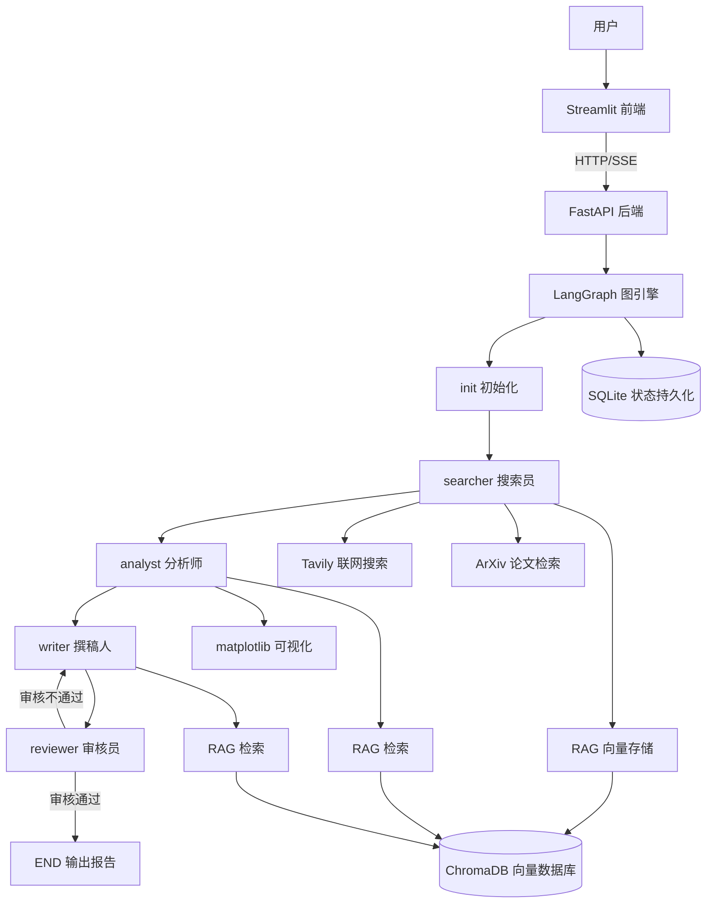

# Multi-Agent 智能行业研究系统 — 技术学习指南

> 本指南面向有一定 Python 基础但不了解项目中各项技术的开发者，帮助你从零理解整个系统的实现原理。

---

## 第一部分：项目总览

### 项目定位

这是一个 **Multi-Agent（多智能体）智能行业研究系统**。用户只需输入一个行业关键词（如"2026年储能市场"），系统就会自动：

1. **联网搜索**：通过 Tavily API 搜索网络信息，通过 ArXiv 搜索学术论文
2. **深度分析**：LLM 对搜索结果进行结构化分析，提取市场规模、竞争格局等关键数据
3. **可视化**：自动生成趋势图、饼图、对比图等数据可视化图表
4. **撰写报告**：生成学术论文风格的 Markdown 研究报告
5. **人工审核**：支持用户审核报告并提出修改意见，系统自动返工修改
6. **引用管理**：自动维护文献引用列表，确保数据可溯源

### 项目目录结构

```
d:\learn_agent\
├── backend/                    # 后端服务
│   ├── agents/                 # 多智能体定义
│   │   ├── searcher.py        #   搜索员 — 联网搜索收集信息
│   │   ├── analyst.py         #   分析师 — 深度分析提取数据
│   │   ├── writer.py          #   撰稿人 — 撰写研究报告
│   │   └── supervisor.py      #   主管 — 路由决策
│   ├── api/                    # API 层
│   │   ├── routes.py          #   路由定义（REST + SSE）
│   │   └── schemas.py         #   Pydantic 请求/响应模型
│   ├── graph/                  # LangGraph 图引擎
│   │   ├── state.py           #   全局状态定义（TypedDict）
│   │   ├── builder.py         #   图拓扑构建
│   │   └── checkpointer.py    #   状态持久化配置
│   ├── tools/                  # Agent 工具集
│   │   ├── search.py          #   Tavily 搜索工具
│   │   ├── arxiv_tool.py      #   ArXiv 论文检索工具
│   │   ├── visualization.py   #   matplotlib 可视化工具
│   │   └── rag.py             #   RAG 检索/存储工具
│   ├── utils/
│   │   └── document_store.py  # ChromaDB 向量存储
│   ├── config.py              # 配置管理（Pydantic Settings）
│   └── main.py                # FastAPI 应用入口
├── frontend/
│   └── app.py                 # Streamlit 前端界面
├── tests/                     # 测试套件
├── output/                    # 输出目录（图表、向量数据库）
├── checkpoints.db             # SQLite 状态持久化数据库
├── requirements.txt           # Python 依赖
├── pytest.ini                 # 测试配置
└── .env.example               # 环境变量模板
```

### 技术栈一览

| 技术 | 版本要求 | 用途 | 在项目中的角色 |
|------|---------|------|---------------|
| **LangGraph** | >=1.1 | 多智能体编排 | 核心引擎，编排 Agent 协作流程 |
| **LangChain** | >=0.3 | LLM 调用框架 | 封装 OpenAI API、工具绑定 |
| **langchain-openai** | >=0.3 | OpenAI 集成 | ChatOpenAI 模型 |
| **FastAPI** | >=0.135 | Web 框架 | 后端 HTTP API + SSE |
| **Streamlit** | >=1.30 | 前端框架 | 交互式 Web 界面 |
| **Tavily** | latest | 搜索 API | 联网搜索和内容提取 |
| **arxiv** | latest | 学术检索 | 论文搜索和下载 |
| **pymupdf** | latest | PDF 解析 | 从论文 PDF 提取文本 |
| **ChromaDB** | latest | 向量数据库 | RAG 文档存储和检索 |
| **matplotlib** | latest | 数据可视化 | 生成静态 PNG 图表 |
| **Pydantic** | v2 | 数据校验 | 配置管理 + API 模型 |
| **SQLite** | 内置 | 持久化 | LangGraph 状态存储 |
| **pytest** | latest | 测试框架 | 单元测试 + 集成测试 |

### 架构图



### 数据流：从用户输入到报告输出

```
用户输入主题 → POST /api/research → 生成 thread_id → 后台启动 LangGraph
    │
    ▼
[init 节点] 初始化状态字段
    │
    ▼
[searcher 节点] LLM + 工具调用循环
    ├── tavily_search: 联网搜索
    ├── tavily_extract: 网页内容提取
    ├── arxiv_search: 学术论文搜索
    ├── arxiv_download: 论文 PDF 下载与文本提取
    └── rag_store: 将搜索结果存入向量数据库
    │
    ▼
[analyst 节点] LLM + 工具调用循环
    ├── rag_search: 从向量数据库精确检索
    ├── generate_trend_chart: 趋势折线图
    ├── generate_competition_chart: 竞争格局饼图/柱状图
    └── generate_comparison_chart: 多维度对比柱状图
    │
    ▼
[writer 节点] LLM + 工具调用循环
    ├── rag_search: 补充检索引用细节
    └── 撰写 Markdown 格式报告
    │
    ▼
[reviewer 节点] interrupt() 暂停 → SSE 推送草稿到前端
    │
    ├── 审核通过 → final_report → END
    └── 审核不通过 → 回到 writer 节点修改（最多 3 次）
    │
    ▼
GET /api/research/{thread_id}/report → 前端展示报告
```

### 各模块职责一览

| 模块 | 路径 | 职责 |
|------|------|------|
| 配置管理 | `backend/config.py` | 集中管理 API Key、模型名称等配置 |
| 应用入口 | `backend/main.py` | FastAPI 应用创建、生命周期管理、CORS 配置 |
| 状态定义 | `backend/graph/state.py` | 定义全局 AgentState（TypedDict） |
| 图构建器 | `backend/graph/builder.py` | 定义多智能体协作的图拓扑 |
| 状态持久化 | `backend/graph/checkpointer.py` | SQLite checkpointer 配置 |
| 搜索员 | `backend/agents/searcher.py` | 联网搜索收集行业信息 |
| 分析师 | `backend/agents/analyst.py` | 深度分析并提取关键数据 |
| 撰稿人 | `backend/agents/writer.py` | 撰写结构化 Markdown 报告 |
| 主管 | `backend/agents/supervisor.py` | 路由决策（审核通过/返工） |
| Tavily 工具 | `backend/tools/search.py` | 网络搜索与内容提取 |
| ArXiv 工具 | `backend/tools/arxiv_tool.py` | 学术论文搜索与下载 |
| 可视化工具 | `backend/tools/visualization.py` | matplotlib 图表生成 |
| RAG 工具 | `backend/tools/rag.py` | 向量数据库检索与存储 |
| 文档存储 | `backend/utils/document_store.py` | ChromaDB 向量存储实现 |
| API 路由 | `backend/api/routes.py` | REST 端点 + SSE 流式推送 |
| 数据模型 | `backend/api/schemas.py` | Pydantic 请求/响应模型 |
| 前端 | `frontend/app.py` | Streamlit 交互界面 |

### 模块间依赖关系

```
main.py
  ├── config.py（配置）
  ├── graph/builder.py（构建图）
  │     ├── graph/state.py（状态定义）
  │     ├── agents/searcher.py（搜索员）
  │     │     ├── tools/search.py（Tavily）
  │     │     ├── tools/arxiv_tool.py（ArXiv）
  │     │     └── tools/rag.py → utils/document_store.py（RAG）
  │     ├── agents/analyst.py（分析师）
  │     │     ├── tools/visualization.py（可视化）
  │     │     └── tools/rag.py（RAG 检索）
  │     ├── agents/writer.py（撰稿人）
  │     │     └── tools/rag.py（RAG 检索）
  │     └── agents/supervisor.py（路由决策）
  ├── graph/checkpointer.py（持久化）
  └── api/routes.py（API 路由）
        └── api/schemas.py（数据模型）
```

---

## 第二部分：核心技术栈详解

---

### 第1章：LangGraph — 多智能体编排引擎

#### 1.1 LangGraph 是什么

LangGraph 是 LangChain 团队推出的框架，用于构建**有状态的多步骤 AI 应用**。你可以把它想象成一个"流程图引擎"——每个节点是一个处理步骤（比如搜索、分析、写作），节点之间通过边连接，形成一张完整的执行图。

**为什么选择 LangGraph？**
- **状态管理**：内置全局状态机制，各节点共享和更新数据
- **条件路由**：支持根据运行时状态动态决定下一步
- **人工介入**：原生支持 `interrupt()` 暂停，实现 Human-in-the-loop
- **流式执行**：支持 `astream()` 实时获取中间结果
- **持久化**：通过 checkpointer 保存/恢复状态

#### 1.2 StateGraph 核心概念

在深入代码之前，先理解 LangGraph 的三个核心概念。你可以把 StateGraph 想象成一个“流程图引擎”：

- **状态（State）**：一个全局共享的数据字典，所有节点都可以读取和修改它
- **节点（Node）**：一个处理函数，接收状态，返回状态更新
- **边（Edge）**：定义节点之间的执行顺序

**节点（Node）**：每个节点是一个异步函数，接收全局状态，返回状态更新字典。

```python
async def init_node(state: AgentState) -> dict[str, Any]:
    topic = state.get("topic", "未命名研究主题")
    return {
        "current_phase": "searching",
        "search_results": [],
        # ... 其他字段初始化
    }
```

> **重要**：节点函数返回的字典是“增量更新”，不是完整状态。LangGraph 会自动将返回值合并到全局状态中。

**边（Edge）**：定义节点之间的执行顺序。

```python
builder.add_edge("init", "searcher")     # init 执行完后 → searcher
builder.add_edge("searcher", "analyst")  # searcher 执行完后 → analyst
```

边还可以连接特殊节点：
- `START`：图的入口，表示流程开始
- `END`：图的出口，表示流程结束

```python
builder.add_edge(START, "init")   # 流程从 init 开始
builder.add_edge("reviewer", END) # reviewer 之后流程结束
```

**条件边（Conditional Edge）**：根据运行时状态动态选择下一个节点。

```python
builder.add_conditional_edges(
    "reviewer",
    should_continue_or_end,   # 路由函数
    {
        "completed": END,     # 返回 "completed" → 结束
        "revise": "writer",   # 返回 "revise" → 回到 writer
    },
)
```

条件边由三部分组成：
1. **源节点**：从哪个节点出发（`"reviewer"`）
2. **路由函数**：接收状态，返回一个字符串（`should_continue_or_end`）
3. **映射表**：字符串 → 下一个节点（`{"completed": END, "revise": "writer"}`）

#### 1.3 TypedDict 状态管理：Annotated 累加器模式

本项目使用 `TypedDict` 定义全局状态。先看看完整的状态定义：

```python
from typing import Annotated, Any
from typing_extensions import TypedDict
from langchain_core.messages import BaseMessage
from langgraph.graph.message import add_messages

class AgentState(TypedDict):
    # 消息列表 — 累加器模式
    messages: Annotated[list[BaseMessage], add_messages]
    # 研究主题
    topic: str
    # 当前阶段
    current_phase: str
    # 搜索结果
    search_results: list[dict[str, Any]]
    # 分析数据
    analysis_data: dict[str, Any]
    # 报告草稿
    report_draft: str
    # 审核反馈
    review_feedback: str | None
    # 最终报告
    final_report: str
    # 重试计数
    revision_count: int
    max_revisions: int
    references: list[dict[str, Any]]
    charts: list[str]
```

**关键理解 `Annotated` 累加器模式**：

`messages` 字段的类型是 `Annotated[list[BaseMessage], add_messages]`。这意味着：
- 普通字段（如 `topic`）：节点返回新值时**覆盖**旧值
- `messages` 字段：节点返回新消息时**追加**到列表（而不是覆盖）

`add_messages` 是 LangGraph 提供的 reducer 函数，它会将新消息追加到现有列表。这样每个节点只需要返回自己产生的消息，不用担心覆盖其他节点的消息。

```python
# 搜索员节点只需返回自己产生的消息
return {
    "messages": [final_response],  # 追加，不是覆盖！
    "search_results": search_results,  # 覆盖
}
```

**状态更新机制图解**：

```
全局状态: {messages: [A, B], topic: "储能", search_results: []}

节点返回: {messages: [C], search_results: [R1, R2]}

更新后:   {messages: [A, B, C], topic: "储能", search_results: [R1, R2]}
                      ↑ 追加                    ↑ 覆盖
```

#### 1.4 本项目中的图拓扑

```
START → init → searcher → analyst → writer → reviewer ─┬→ END
                                                          └→ writer（返工）
```

- **线性流水线**：`init → searcher → analyst → writer → reviewer`
- **循环**：`reviewer → writer`（审核不通过时，最多循环 3 次）
- **条件出口**：`reviewer → END`（审核通过 或 超过重试上限）

#### 1.5 代码走读：builder.py 关键代码

```python
def build_graph(checkpointer=None):
    # 1. 创建 StateGraph，绑定状态类型
    builder = StateGraph(AgentState)

    # 2. 注册 5 个节点
    builder.add_node("init", init_node)
    builder.add_node("searcher", searcher_agent)
    builder.add_node("analyst", analyst_agent)
    builder.add_node("writer", writer_agent)
    builder.add_node("reviewer", reviewer_node)

    # 3. 线性边 — 定义执行顺序
    builder.add_edge(START, "init")
    builder.add_edge("init", "searcher")
    builder.add_edge("searcher", "analyst")
    builder.add_edge("analyst", "writer")
    builder.add_edge("writer", "reviewer")

    # 4. 条件边 — reviewer 之后的分支
    builder.add_conditional_edges(
        "reviewer",
        should_continue_or_end,
        {"completed": END, "revise": "writer"},
    )

    # 5. 编译并附加 checkpointer
    graph = builder.compile(checkpointer=checkpointer)
    return graph
```

#### 1.6 LangGraph vs 其他编排方式

| 特性 | LangGraph | 纯 Python 脚本 | LangChain AgentExecutor |
|------|-----------|----------------|----------------------|
| 状态管理 | 内置全局状态 | 手动传递变量 | 有限 |
| 条件路由 | 支持条件边 | if/else | 不支持 |
| 人工介入 | 原生 interrupt() | 手动实现 | 不支持 |
| 流式执行 | astream() | 不支持 | 部分支持 |
| 状态持久化 | checkpointer | 手动实现 | 不支持 |
| 可视化 | LangGraph Studio | 无 | 无 |

#### 1.7 如何添加新节点

1. 在 `builder.py` 中定义新的异步函数：
```python
async def my_new_node(state: AgentState) -> dict[str, Any]:
    # 处理逻辑
    return {"current_phase": "my_phase", ...}
```

2. 注册节点并调整边：
```python
builder.add_node("my_node", my_new_node)
builder.add_edge("writer", "my_node")     # writer → my_node
builder.add_edge("my_node", "reviewer")   # my_node → reviewer
```

3. 如果需要新字段，在 `state.py` 的 `AgentState` 中添加。

> **提示**：修改图拓扑后，建议运行 `pytest tests/test_graph.py` 确保图可以正常编译。

---

### 第2章：LangChain — LLM 调用与工具绑定

#### 2.1 ChatOpenAI 初始化与配置

LangChain 的 `ChatOpenAI` 是对 OpenAI API 的统一封装：

```python
from langchain_openai import ChatOpenAI

llm = ChatOpenAI(
    model=settings.openai_model,      # 如 "gpt-4o"
    api_key=settings.openai_api_key,
    base_url=settings.openai_base_url, # 可选，用于自定义 API 端点
    temperature=0.1,                   # 低温度 → 更确定性的输出
)
```

**关键参数**：
- `temperature`：控制随机性。搜索员/分析师用 0.1（精确），撰稿人用 0.3（稍有创造性）
- `base_url`：支持代理或兼容 API（如 Azure OpenAI、本地 Ollama）

#### 2.2 bind_tools 机制

`bind_tools()` 让 LLM 知道有哪些工具可用，并在需要时生成工具调用请求：

```python
tools = [tavily_search, tavily_extract, arxiv_search, arxiv_download]
llm_with_tools = llm.bind_tools(tools)
```

调用 `llm_with_tools.ainvoke(messages)` 时，LLM 会：
1. 分析用户请求
2. 决定是否需要调用工具
3. 如果需要，返回 `tool_calls`（包含工具名和参数）
4. 如果不需要，直接返回文本回复

#### 2.3 工具调用循环（Tool Call Loop）

这是本项目最核心的模式之一。以搜索员为例：

```python
for i in range(10):  # 最多 10 轮
    # 1. 调用 LLM
    response = await llm_with_tools.ainvoke(messages)
    messages.append(response)

    # 2. 检查是否有工具调用
    if not response.tool_calls:
        break  # LLM 认为搜索完成

    # 3. 执行每个工具调用
    for tool_call in response.tool_calls:
        tool_name = tool_call["name"]
        tool_args = tool_call["args"]
        result = tool_map[tool_name].invoke(tool_args)

        # 4. 将结果作为 ToolMessage 加入消息列表
        messages.append(
            ToolMessage(content=str(result), tool_call_id=tool_call["id"])
        )
```

**循环流程图**：

```
┌─────────────────────────────────────────┐
│            工具调用循环              │
│                                         │
│  ┌─────────┐    ┌──────────┐  │
│  │ LLM 思考 │───▶│ 有工具调用? │  │
│  └─────────┘    └────┬─────┘  │
│       ▲              │           │
│       │         是 │        否 │
│       │              ▼           │
│  ┌─────────┐    ┌──────────┐  │
│  │ 执行工具 │◀──│ 返回结果给 LLM │  │
│  └─────────┘    └──────────┘  │
│       │              │           │
│       └──────────┘        │
│                      ┌─────▼────┐  │
│                      │ 结束循环 │  │
│                      └──────────┘  │
└─────────────────────────────────────────┘
```

**消息类型说明**：

| 消息类型 | 角色 | 用途 |
|---------|------|------|
| `SystemMessage` | system | 系统提示词，定义 Agent 行为 |
| `HumanMessage` | user | 用户输入 |
| `AIMessage` | assistant | LLM 回复（含 tool_calls） |
| `ToolMessage` | tool | 工具执行结果 |

**tool_call 结构**：

```python
# response.tool_calls 是一个列表，每个元素结构如下：
{
    "name": "tavily_search",           # 工具名称
    "args": {"query": "储能市场规模"},   # 工具参数
    "id": "call_abc123",               # 调用 ID（用于关联 ToolMessage）
}
```

#### 2.4 @tool 装饰器：自定义工具

LangChain 的 `@tool` 装饰器将普通函数变成 LLM 可调用的工具：

```python
from langchain_core.tools import tool

@tool
def tavily_search(query: str) -> str:
    """使用 Tavily 进行网络搜索。输入搜索查询字符串，返回结构化搜索结果。

    Args:
        query: 搜索查询字符串
    """
    # 实现...
```

**关键点**：
- 函数名 → 工具名（LLM 通过这个名字调用）
- **docstring** → 工具描述（LLM 通过这段文字理解工具功能）
- 参数类型注解 → 参数 schema（LLM 据此生成参数）
- 返回值 → 工具执行结果（字符串形式返回给 LLM）

#### 2.5 代码走读：searcher.py 中的工具调用循环

搜索员是项目中最复杂的 Agent，它的工具调用循环包含以下步骤：

**步骤 1：初始化 LLM 和工具**

```python
llm = ChatOpenAI(
    model=settings.openai_model,
    api_key=settings.openai_api_key,
    base_url=settings.openai_base_url,
    temperature=0.1,
)
tools = [tavily_search, tavily_extract, arxiv_search, arxiv_download]
llm_with_tools = llm.bind_tools(tools)
tool_map = {tool.name: tool for tool in tools}  # 名称 → 工具对象映射
```

**步骤 2：构建初始消息**

```python
messages = [
    SystemMessage(content=SEARCHER_SYSTEM_PROMPT),  # 系统提示词
    HumanMessage(content=f"请对以下行业主题进行全面搜索：{topic}"),  # 用户输入
]
```

**步骤 3：工具调用循环（最多 10 轮）**

每一轮中：
1. 调用 LLM，获取响应
2. 检查是否有 `tool_calls`
3. 如果有，逐个执行工具，将结果作为 `ToolMessage` 加入消息
4. LLM 根据工具结果决定下一步行动

**步骤 4：记录搜索结果**

每次工具调用的结果都存入 `all_search_results`，区分来源：
- `web`：来自 tavily_search
- `arxiv`：来自 arxiv_search
- `arxiv_pdf`：来自 arxiv_download

**步骤 5：存储到向量数据库**

```python
for item in search_results:
    rag_store.invoke({"text": content, "source": f"{source}:{query}"})
```

**步骤 6：LLM 做最终总结**

```python
messages.append(HumanMessage(content="请总结你搜索到的所有信息..."))
final_response = await llm.ainvoke(messages)
```

> **设计思考**：为什么搜索员需要工具调用循环？因为搜索不是一次性的。LLM 会先搜索几个关键词，根据结果发现新的搜索方向，再搜索更多。这种“迭代式搜索”模拟了人类研究员的工作方式。

---

### 第3章：Function Calling — Agent 的决策能力

#### 3.1 OpenAI Function Calling 原理

OpenAI 的 Function Calling 是一种结构化输出机制。当你发送消息给 GPT 时，可以同时提供可用工具的 JSON Schema。GPT 会：

1. 分析用户意图
2. 判断是否需要调用工具
3. 选择最合适的工具，生成符合 schema 的参数 JSON
4. 将工具调用结果整合为最终回复

```
用户消息 + 工具定义 → GPT → 工具调用请求（JSON）
                                ↓
                          执行工具获取结果
                                ↓
                   工具结果 + 历史消息 → GPT → 最终回复
```

#### 3.2 LLM 如何决定调用哪个工具

LLM 基于以下信息做决策：
- **工具的 docstring**：描述工具的功能和使用场景
- **参数 schema**：告诉 LLM 需要提供什么参数
- **对话上下文**：当前任务目标和已有信息

这就是为什么 docstring 的质量至关重要——它直接影响 LLM 的工具选择准确性。

**实际例子**：

当搜索员收到"研究储能市场"的任务时，LLM 的决策过程大致如下：

```
系统提示词: "你是搜索员，用 tavily_search 搜索网络，用 arxiv_search 搜索论文..."
用户消息: "请全面搜索储能市场"

LLM 思考:
1. 需要搜索市场规模 → tavily_search("储能市场规模")
2. 需要搜索竞争格局 → tavily_search("储能市场头部企业")
3. 需要搜索学术论文 → arxiv_search("energy storage market")
4. 看到有价值的 URL → tavily_extract(["https://..."])
5. 看到有价值的论文 → arxiv_download("2301.12345")
6. 信息已足够充分 → 不再调用工具，返回总结
```

**工具描述对决策的影响**：

```python
# 差的描述 — LLM 可能不知道何时使用
@tool
def search(query: str) -> str:
    """搜索"""
    ...

# 好的描述 — LLM 清楚理解使用场景
@tool
def tavily_search(query: str) -> str:
    """使用 Tavily 进行网络搜索。输入搜索查询字符串，
    返回包含标题、URL、摘要的结构化搜索结果。
    适用于查找行业数据、市场信息、新闻动态。

    Args:
        query: 搜索查询字符串，例如 "2024年中国新能源汽车市场趋势"
    """
    ...
```

#### 3.3 本项目中 4 类工具的实现对比

| 工具 | 类型 | 输入 | 输出 | 特点 |
|------|------|------|------|------|
| `tavily_search` | 网络搜索 | 查询字符串 | 结构化搜索结果 | 调用外部 API |
| `tavily_extract` | 内容提取 | URL 列表 | 网页文本内容 | 调用外部 API |
| `arxiv_search` | 学术搜索 | 关键词 | 论文元数据 | 调用 ArXiv API |
| `arxiv_download` | 论文下载 | 论文 ID | 论文全文文本 | 下载 PDF + fitz 解析 |
| `generate_trend_chart` | 可视化 | JSON 数据 | 图表文件路径 | matplotlib 绘图 |
| `generate_competition_chart` | 可视化 | JSON 数据 | 图表文件路径 | 饼图/柱状图 |
| `generate_comparison_chart` | 可视化 | JSON 数据 | 图表文件路径 | 多维对比图 |
| `rag_search` | RAG 检索 | 查询文本 | 相关文档片段 | ChromaDB 向量检索 |
| `rag_store` | RAG 存储 | 文本+来源 | 存储确认 | ChromaDB 向量存储 |

**工具设计模式对比**：

**模式 1：外部 API 调用型**（Tavily、ArXiv）
```python
@tool
def tavily_search(query: str) -> str:
    client = get_tavily_client()  # 获取 API 客户端
    response = client.search(query=query, ...)  # 调用外部 API
    return format_results(response)  # 格式化返回
```
特点：依赖外部服务，需要 API Key，返回实时数据

**模式 2：本地计算型**（可视化）
```python
@tool
def generate_trend_chart(data_json: str, chart_name: str) -> str:
    data = json.loads(data_json)  # 解析输入数据
    fig, ax = plt.subplots()      # 创建图表
    # ... 绑定数据 ...
    filepath = _save_chart(fig, chart_name)  # 保存到本地文件
    return f"图表已生成: {filepath}"
```
特点：纯本地执行，生成文件，无外部依赖

**模式 3：数据库操作型**（RAG）
```python
@tool
def rag_search(query: str, n_results: int = 5) -> str:
    store = DocumentStore()              # 连接向量数据库
    results = store.search(query=query)  # 执行相似度检索
    return format_results(results)
```
特点：本地数据库操作，基于向量相似度检索

---

### 第4章：Tavily API — 联网搜索能力

#### 4.1 Tavily 是什么

[Tavily](https://tavily.com/) 是专为 AI Agent 设计的搜索 API。与传统搜索引擎不同，它直接返回结构化的、经过 AI 处理的结果，非常适合 LLM 消费。

#### 4.2 search 和 extract 两个 API 的区别

| API | 功能 | 输入 | 输出 |
|-----|------|------|------|
| `search` | 网络搜索 | 查询字符串 | 多条结果（标题+URL+摘要+AI 摘要） |
| `extract` | 内容提取 | URL 列表 | 每个 URL 的网页全文内容 |

**典型使用流程**：先用 `search` 找到相关网页 → 再用 `extract` 获取有价值的网页全文。

#### 4.3 代码走读：search.py

```python
# 客户端单例模式 — 避免重复创建
_tavily_client = None

def get_tavily_client() -> TavilyClient:
    global _tavily_client
    if _tavily_client is None:
        if not settings.tavily_api_key:
            raise ValueError("TAVILY_API_KEY 未配置")
        _tavily_client = TavilyClient(api_key=settings.tavily_api_key)
    return _tavily_client

@tool
def tavily_search(query: str) -> str:
    """使用 Tavily 进行网络搜索。输入搜索查询字符串，返回结构化搜索结果。

    Args:
        query: 搜索查询字符串，例如 "2024年中国新能源汽车市场趋势"
    """
    try:
        client = get_tavily_client()
        response = client.search(
            query=query,
            max_results=5,           # 返回 5 条结果
            search_depth="advanced",  # 深度搜索（更慢但更准确）
            include_answer=True,      # 包含 AI 生成的摘要
        )
        # 格式化结果...
```

**`tavily_search` 参数详解**：

| 参数 | 类型 | 说明 |
|------|------|------|
| `query` | str | 搜索查询字符串 |
| `max_results` | int | 返回结果数量（默认 5） |
| `search_depth` | str | `"basic"` 快速但浅层，`"advanced"` 慢但深入 |
| `include_answer` | bool | 是否包含 AI 生成的摘要 |

**`tavily_search` 返回值结构**：

```python
{
    "answer": "AI 生成的摘要...",  # 当 include_answer=True 时
    "results": [
        {
            "title": "网页标题",
            "url": "https://example.com/article",
            "content": "网页内容摘要...",
        },
        # ... 更多结果
    ]
}
```

**`tavily_extract` 详解**：

```python
@tool
def tavily_extract(urls: list[str]) -> str:
    """从指定 URL 列表提取网页文本内容。"""
    client = get_tavily_client()
    response = client.extract(urls=urls)
    for item in response.get("results", []):
        raw_content = item.get("raw_content") or item.get("content", "N/A")
        truncated = raw_content[:2000]  # 截取前 2000 字符
```

**`tavily_extract` 与 `tavily_search` 的区别**：

| 特性 | tavily_search | tavily_extract |
|------|--------------|----------------|
| 输入 | 查询字符串 | URL 列表 |
| 输出 | 多条摘要 | 网页全文内容 |
| 用途 | 发现相关信息 | 深入阅读特定网页 |
| 典型流程 | 第一步：找到相关网页 | 第二步：获取全文详情 |

**设计要点**：
- 单例模式缓存客户端，避免每次调用都创建新连接
- `search_depth="advanced"` 使用深度搜索，提高结果质量
- 结果格式化为可读字符串，方便 LLM 理解
- 错误处理返回字符串而非抛异常，保证工具调用循环不中断
- 内容截取前 2000 字符，避免超出 LLM 上下文窗口

---

### 第5章：ArXiv — 学术论文检索

#### 5.1 arxiv Python 库

`arxiv` 库封装了 ArXiv API，提供论文搜索和下载功能：

```python
import arxiv

client = arxiv.Client(page_size=10, delay_seconds=3, num_retries=2)
search = arxiv.Search(
    query="energy storage lithium",
    max_results=5,
    sort_by=arxiv.SortCriterion.Relevance
)
results = list(client.results(search))
```

#### 5.2 论文搜索和 PDF 下载提取

`arxiv_search`：搜索论文，返回标题、作者、摘要、arXiv ID。

```python
@tool
def arxiv_search(query: str, max_results: int = 5) -> str:
    search = arxiv.Search(query=query, max_results=max_results, ...)
    results = list(client.results(search))
    for paper in results:
        # paper.title, paper.authors, paper.summary, paper.entry_id
```

`arxiv_download`：下载 PDF → 提取全文 → 清理临时文件。

#### 5.3 pymupdf（fitz）PDF 文本提取

```python
import fitz  # pymupdf

doc = fitz.open(str(pdf_path))
text = ""
for page in doc:
    text += page.get_text()  # 逐页提取文本
doc.close()
```

**pymupdf** 是一个高性能的 PDF 解析库，支持文本提取、图片提取、页面渲染等。这里用于从下载的论文 PDF 中提取纯文本。

#### 5.4 代码走读：arxiv_tool.py

**arxiv_search 完整实现**：

```python
@tool
def arxiv_search(query: str, max_results: int = 5) -> str:
    """搜索 ArXiv 学术论文。输入研究主题或关键词，返回论文标题、作者、摘要等。"""
    client = get_arxiv_client()
    search = arxiv.Search(
        query=query,
        max_results=max_results,
        sort_by=arxiv.SortCriterion.Relevance  # 按相关性排序
    )
    results = list(client.results(search))

    for i, paper in enumerate(results, 1):
        authors = ", ".join([a.name for a in paper.authors[:5]])
        if len(paper.authors) > 5:
            authors += " et al."  # 超过 5 个作者显示 "et al."
        paper_id = paper.entry_id.split("/")[-1]
        # 输出: 标题、作者、日期、arXiv ID、分类、摘要前 500 字符
```

**arxiv_download 完整实现**：

```python
@tool
def arxiv_download(paper_id: str) -> str:
    """根据 ArXiv ID 下载论文 PDF 并提取全文文本。"""
    # 1. 查找论文
    search = arxiv.Search(id_list=[paper_id])
    paper = list(client.results(search))[0]

    # 2. 下载到项目 output 目录（不在 C 盘生成文件）
    output_dir = Path(__file__).parent.parent.parent / "output"
    paper.download_pdf(dirpath=str(output_dir), filename=f"{safe_id}.pdf")

    # 3. 用 pymupdf 提取文本
    doc = fitz.open(str(pdf_path))
    text = "".join(page.get_text() for page in doc)
    doc.close()

    # 4. 清理临时 PDF
    os.remove(str(pdf_path))

    # 5. 截取前 3000 字符返回
    return f"论文: {paper.title}\n作者: {authors}\n\n全文内容:\n{text[:3000]}"
```

**ArXiv API 注意事项**：
- `delay_seconds=3`：请求间隔 3 秒，避免被 ArXiv 封禁
- `num_retries=2`：失败重试 2 次
- 下载 PDF 后必须用 pymupdf 提取文本，因为 ArXiv 返回的是 PDF 格式
- 临时文件必须清理，避免磁盘空间浪费

---

### 第6章：RAG 检索增强生成

#### 6.1 为什么需要 RAG

**RAG（Retrieval-Augmented Generation）** 解决 LLM 的两个核心问题：
1. **知识时效性**：LLM 训练数据有截止日期，无法获取最新信息
2. **上下文限制**：搜索结果可能很多，全部塞入 prompt 会超出 token 限制

RAG 的工作流程：
```
文档 → 分块 → Embedding → 存入向量数据库
                                ↓
用户查询 → Embedding → 与向量库中的文档比较相似度 → 返回最相关的文档片段
                                ↓
                        相关片段 + 原始问题 → LLM → 精准回答
```

#### 6.2 ChromaDB 向量数据库

ChromaDB 是一个轻量级的开源向量数据库，特别适合 RAG 场景：

```python
import chromadb

# 持久化客户端 — 数据存储在本地磁盘
client = chromadb.PersistentClient(path="output/chroma_db")

# 创建集合（使用 cosine 相似度）
collection = client.get_or_create_collection(
    name="research_docs",
    metadata={"hnsw:space": "cosine"}
)
```

**关键概念**：
- **PersistentClient**：数据持久化到磁盘，重启不丢失
- **Collection**：类似数据库表，存储文档和对应的向量
- **HNSW**：Hierarchical Navigable Small World，一种高效的近似最近邻搜索算法
- **cosine 相似度**：衡量两段文本语义相似程度，值域 [0, 2]，越小越相似

#### 6.3 文本分块策略

```python
@staticmethod
def _chunk_text(text: str, chunk_size: int = 500, overlap: int = 50) -> list[str]:
    if len(text) <= chunk_size:
        return [text]
    chunks = []
    start = 0
    while start < len(text):
        chunk = text[start:start + chunk_size]
        chunks.append(chunk)
        start = (start + chunk_size) - overlap  # 回退 overlap 个字符
    return chunks
```

**参数含义**：
- `chunk_size=500`：每个块最多 500 个字符
- `overlap=50`：相邻块重叠 50 个字符，避免关键信息被截断

**为什么需要分块？**
- Embedding 模型有输入长度限制
- 小块更容易精确匹配查询
- 重叠确保不会在关键位置断裂

#### 6.4 Embedding 相似度检索

ChromaDB 内部使用默认的 Embedding 模型将文本转为向量。检索时：
1. 查询文本 → Embedding 模型 → 查询向量
2. 查询向量 vs 库中所有向量 → cosine 距离排序
3. 返回距离最小的 N 个文档块

```python
def search(self, query: str, n_results: int = 5) -> list[dict]:
    results = self.collection.query(
        query_texts=[query],   # 自动做 embedding
        n_results=n_results
    )
    # 返回 content + metadata + distance
```

**什么是 Embedding？**

Embedding 是将文本转化为高维向量的过程。语义相似的文本，其向量在空间中也更接近。

```
"储能市场规模" → [0.12, -0.34, 0.56, ..., 0.78]  # 1536维向量
"电池行业发展" → [0.11, -0.32, 0.55, ..., 0.77]  # 语义相近，向量也接近
"今天天气很好" → [-0.45, 0.67, -0.12, ..., 0.33]  # 语义不同，向量远离
```

**Cosine 相似度计算**：

```
cosine_similarity(A, B) = (A · B) / (||A|| × ||B||)
```

值域 [-1, 1]，值越大表示越相似。ChromaDB 使用 cosine distance = 1 - similarity，所以距离越小越相似。

#### 6.5 代码走读：document_store.py 和 rag.py

**document_store.py** — 底层存储封装：

```python
class DocumentStore:
    def __init__(self, collection_name="research_docs"):
        self.client = chromadb.PersistentClient(path=str(CHROMA_DIR))
        self.collection = self.client.get_or_create_collection(
            name=collection_name,
            metadata={"hnsw:space": "cosine"}
        )

    def add_documents(self, documents, metadatas=None, ids=None):
        # 自动分块 → 生成 ID → 存入集合
        for doc in documents:
            chunks = self._chunk_text(doc, chunk_size=500, overlap=50)
            # 每个 chunk 有独立 ID 和 metadata

    def search(self, query, n_results=5):
        # 向量相似度检索
        results = self.collection.query(query_texts=[query], n_results=n_results)
        return [{"content": doc, "metadata": meta, "distance": dist} ...]
```

**rag.py** — LangChain 工具封装：

```python
@tool
def rag_search(query: str, n_results: int = 5) -> str:
    store = DocumentStore()
    results = store.search(query=query, n_results=n_results)
    # 格式化返回

@tool
def rag_store(text: str, source: str = "unknown") -> str:
    store = DocumentStore()
    store.add_documents(documents=[text], metadatas=[{"source": source}])
    # 返回确认
```

#### 6.6 搜索员存储、分析师/撰稿人检索的协作流程

```
搜索员完成搜索 → 遍历搜索结果 → 逐条调用 rag_store 存入 ChromaDB
                                          ↓
分析师开始分析 → 调用 rag_search 精确检索特定数据
                                          ↓
撰稿人撰写报告 → 调用 rag_search 补充引用细节
```

---

### 第7章：状态持久化 — Checkpointer

#### 7.1 为什么需要状态持久化

在多步骤 AI 应用中：
- 应用重启后需要恢复之前的状态
- Human-in-the-loop 场景需要暂停/恢复执行
- 需要查询历史执行状态（如获取最终报告）

#### 7.2 AsyncSqliteSaver 的工作原理

```python
from langgraph.checkpoint.sqlite.aio import AsyncSqliteSaver

DB_PATH = str(Path(__file__).parent.parent.parent / "checkpoints.db")

def get_checkpointer() -> AsyncSqliteSaver:
    return AsyncSqliteSaver.from_conn_string(DB_PATH)

async def setup_checkpointer(checkpointer):
    await checkpointer.setup()  # 创建内部表
```

**工作机制**：
- 每次节点执行完毕后，checkpointer 自动将状态快照存入 SQLite
- 通过 `thread_id` 区分不同的执行会话
- `graph.aget_state(config)` 可以获取任意时刻的状态快照

#### 7.3 thread_id 与会话管理

```python
# 提交任务时生成唯一 thread_id
thread_id = str(uuid.uuid4())
config = {"configurable": {"thread_id": thread_id}}

# 用同一个 thread_id 恢复执行
state = await graph.aget_state(config)
```

每个研究任务有独立的 `thread_id`，互不干扰。

**会话管理流程**：

```
用户提交任务 → 生成 thread_id = "abc-123"
    │
    ▼
图开始执行 → 每个节点完成后，checkpointer 自动保存状态
    │
    ├── 状态快照 1: {init 完成}
    ├── 状态快照 2: {searcher 完成}
    ├── ...
    ├── 状态快照 5: {reviewer interrupt}
    │
    ▼
用户提交审核 → Command(resume="通过")
    │
    ▼
图从快照 5 恢复 → 继续执行 → 完成
```

**在 API 中的使用**：

```python
# 启动任务时
config = {"configurable": {"thread_id": thread_id}}
async for event in graph.astream(initial_state, config=config, ...):
    ...

# 获取最终报告时
state = await graph.aget_state(config)
final_report = state.values.get("final_report", "")
```

#### 7.4 代码走读：checkpointer.py

整个模块只有 34 行，但它是 Human-in-the-loop 的基础：

```python
DB_PATH = str(Path(__file__).parent.parent.parent / "checkpoints.db")

def get_checkpointer() -> AsyncSqliteSaver:
    return AsyncSqliteSaver.from_conn_string(DB_PATH)

async def setup_checkpointer(checkpointer):
    await checkpointer.setup()
```

在 `main.py` 的 lifespan 中初始化：

```python
async with exit_stack:
    checkpointer = get_checkpointer()
    checkpointer = await exit_stack.enter_async_context(checkpointer)
    await setup_checkpointer(checkpointer)
    graph = build_graph(checkpointer=checkpointer)
    app.state.graph = graph
```

---

### 第8章：Human-in-the-loop — 人工审核

#### 8.1 LangGraph 的 interrupt() 机制

`interrupt()` 是 LangGraph 提供的暂停原语。当图执行到 `interrupt()` 时：

1. 图暂停执行，抛出 `GraphInterrupt` 异常
2. 当前状态被 checkpointer 保存
3. 外部可以获取暂停原因（interrupt value）
4. 外部通过 `Command(resume=...)` 恢复执行

```python
async def reviewer_node(state):
    # 暂停，向前端发送审核请求
    human_feedback = interrupt({
        "type": "review_request",
        "report_draft": state.get("report_draft", ""),
        "message": "请审核报告草稿...",
    })
    # 当外部 resume 后，human_feedback = resume 携带的数据
```

#### 8.2 Command(resume=...) 恢复执行

在后端 API 中：

```python
async for event in graph.astream(
    Command(resume=feedback),  # 恢复图执行，传入用户反馈
    config=config,
    stream_mode=["updates", "messages"],
):
    # 处理后续事件...
```

`Command(resume=feedback)` 会：
1. 从 checkpointer 加载暂停时的状态
2. 将 `feedback` 作为 `interrupt()` 的返回值
3. 继续执行图的后续节点

#### 8.3 自修正闭环的实现

自修正闭环是本项目的亮点功能之一。它允许用户对报告提出修改意见，系统会自动返工。

**完整闭环流程图**：

```
┌─────────┐    ┌─────────┐    ┌─────────┐    ┌─────────┐
│  writer  │───▶│ reviewer│───▶│ 用户审核 │───▶│ 决策判断 │
└─────────┘    └─────────┘    └─────────┘    └────┬────┘
     ▲                                            │
     │              ┌───────────┐           │
     └──────────────│ 通过/超限 │◀───────┘
                    └─────┬─────┘
                          │
                    ┌─────▼─────┐
                    │    END    │
                    └───────────┘
```

**代码实现**：

```python
# reviewer_node 中的逻辑
if is_approved:
    return {"review_feedback": None, "final_report": report_draft, "current_phase": "completed"}

if current_count >= max_revisions:
    return {"final_report": report_draft, "current_phase": "completed"}  # 强制结束

return {"review_feedback": feedback, "revision_count": current_count + 1, "current_phase": "writing"}
```

**审核关键词识别**：

```python
is_approved = feedback_text.lower() in (
    "approved", "通过", "ok", "yes", "好", "approve", "good"
)
```

支持中英文多种通过关键词。

#### 8.4 条件边路由：should_continue_or_end

这个函数是 reviewer 节点之后的“交通指挥”，决定图是结束还是返工：

```python
def should_continue_or_end(state: dict[str, Any]) -> str:
    review_feedback = state.get("review_feedback")
    revision_count = state.get("revision_count", 0)
    max_revisions = state.get("max_revisions", 3)

    # 审核通过
    if review_feedback is None or (
        isinstance(review_feedback, str)
        and review_feedback.strip().lower() in ["通过", "approve", "approved", "ok", "good"]
    ):
        return "completed"

    # 超过最大重试次数
    if revision_count >= max_revisions:
        return "completed"

    # 需要返工
    return "revise"
```

**路由逻辑图解**：

```
reviewer 节点返回状态
    │
    ▼
should_continue_or_end(state)
    │
    ├── review_feedback is None ──────▶ "completed" → END
    ├── review_feedback == "通过" ───▶ "completed" → END
    ├── revision_count >= 3 ─────────▶ "completed" → END
    └── 其他 ──────────────────────▶ "revise" → writer
```

> **设计思考**：为什么最大重试次数是 3？因为经验表明，如果 3 次修改后报告仍不满意，通常是因为数据本身的问题，继续修改不会显著提升质量，反而会浪费 API 调用额度。

---

### 第9章：FastAPI — 后端服务

#### 9.1 FastAPI 基础

FastAPI 是一个高性能的 Python Web 框架，基于 Starlette 和 Pydantic：

```python
app = FastAPI(
    title="Multi-Agent 行业研究系统",
    version="1.0.0",
    lifespan=lifespan,
)

router = APIRouter(prefix="/api", tags=["research"])

@router.post("/research", response_model=ResearchResponse)
async def start_research(request: Request, body: ResearchRequest):
    # ...
```

**核心概念**：
- **路由**：`@router.post/get` 定义 HTTP 端点
- **请求模型**：Pydantic BaseModel 自动校验请求体
- **响应模型**：`response_model` 自动序列化返回值
- **依赖注入**：`Request` 对象自动注入

#### 9.2 Pydantic Settings 配置管理

```python
from pydantic_settings import BaseSettings

class Settings(BaseSettings):
    openai_api_key: str = ""
    openai_base_url: str = ""
    openai_model: str = "gpt-4o"
    tavily_api_key: str = ""
    debug: bool = False

    class Config:
        env_file = ".env"
```

`BaseSettings` 自动从环境变量和 `.env` 文件加载配置，并提供类型校验。

#### 9.3 CORS 中间件配置

```python
app.add_middleware(
    CORSMiddleware,
    allow_origins=["http://localhost:8501", "http://localhost:3000"],
    allow_credentials=True,
    allow_methods=["*"],
    allow_headers=["*"],
)
```

CORS（跨域资源共享）允许前端（localhost:8501）访问后端 API（localhost:8000）。

#### 9.4 应用生命周期管理（lifespan）

`lifespan` 是 FastAPI 的异步上下文管理器，在应用启动时执行初始化，关闭时执行清理。

```python
@asynccontextmanager
async def lifespan(app: FastAPI):
    # ── Startup 阶段 ──
    logger.info("正在初始化 checkpointer 和 LangGraph 图...")

    # 配置校验
    if not settings.openai_api_key:
        logger.warning("⚠️ OPENAI_API_KEY 未配置")

    # 使用 AsyncExitStack 确保异常时也能正确清理资源
    exit_stack = AsyncExitStack()
    async with exit_stack:
        checkpointer = get_checkpointer()
        checkpointer = await exit_stack.enter_async_context(checkpointer)
        await setup_checkpointer(checkpointer)

        graph = build_graph(checkpointer=checkpointer)
        app.state.graph = graph          # 存储到 app.state 供路由使用
        app.state.checkpointer = checkpointer

        logger.info("系统初始化完成 ✓")
        yield   # <-- 应用运行中
    # ── Shutdown 阶段 ──
    # exit_stack 自动处理 cleanup（关闭数据库连接等）
```

**AsyncExitStack 的作用**：

`AsyncExitStack` 是一个异步上下文管理器栈。它的好处是：
- 可以动态添加多个异步上下文管理器
- 即使初始化过程中出现异常，已分配的资源也会被正确释放
- 代码更简洁，不需要嵌套多层 `async with`

**app.state 的作用**：

`app.state` 是 FastAPI 应用的全局存储区，可以在任何路由中通过 `request.app.state` 访问：

```python
@router.get("/report")
async def get_report(request: Request):
    graph = request.app.state.graph  # 获取启动时初始化的图
```

#### 9.5 代码走读：schemas.py

Pydantic v2 的模型定义：

```python
from pydantic import BaseModel, Field, field_validator

class ResearchRequest(BaseModel):
    """提交研究任务请求"""
    topic: str = Field(
        ...,
        min_length=1,
        max_length=200,
        description="研究主题"
    )

    @field_validator("topic")
    @classmethod
    def topic_not_blank(cls, v: str) -> str:
        if not v.strip():
            raise ValueError("研究主题不能为空")
        return v.strip()
```

**Pydantic v2 关键特性**：

| 特性 | 说明 | 示例 |
|------|------|------|
| `Field(...)` | 字段约束 | `min_length`, `max_length`, `description` |
| `field_validator` | 自定义校验逻辑 | 空白字符串检查 |
| `BaseModel` | 自动类型转换和校验 | 传入 int 自动转 str |
| `model_config` | 模型配置 | JSON schema 生成 |

**校验流程**：

```
用户输入 {"topic": "  储能市场  "}
    │
    ▼
Pydantic 类型校验: str ✓
    │
    ▼
Field 约束校验: min_length=1 ✓, max_length=200 ✓
    │
    ▼
field_validator: strip() → "储能市场"
    │
    ▼
校验通过，创建 ResearchRequest 对象
```

**其他模型**：

```python
class ResearchResponse(BaseModel):
    thread_id: str
    status: str = "started"  # 默认值
    topic: str

class ReviewRequest(BaseModel):
    feedback: str  # "通过" 或修改意见

class ReportResponse(BaseModel):
    thread_id: str
    topic: str
    report: str
    status: str
    references: list[dict] = []  # 默认空列表
    charts: list[str] = []

class HealthResponse(BaseModel):
    status: str = "ok"
    version: str = "1.0.0"
```

---

### 第10章：SSE 实时推送

#### 10.1 SSE 协议原理

SSE（Server-Sent Events）是一种基于 HTTP 的单向实时通信协议：

```
HTTP/1.1 200 OK
Content-Type: text/event-stream

event: phase
data: {"phase": "searching"}

event: progress
data: {"message": "搜索员正在搜索相关资料..."}

event: complete
data: {"report": "# 报告内容..."}
```

**格式规则**：
- `event:` 指定事件类型
- `data:` 指定事件数据
- 空行 `\n\n` 分隔事件
- `:` 开头的行是注释（用作心跳）

#### 10.2 StreamingResponse + 异步生成器

```python
async def event_generator():
    while True:
        event = await asyncio.wait_for(event_queue.get(), timeout=15)
        yield f"event: {event_type}\ndata: {data_str}\n\n"

return StreamingResponse(
    event_generator(),
    media_type="text/event-stream",
    headers={"Cache-Control": "no-cache", "Connection": "keep-alive"},
)
```

`StreamingResponse` 接受异步生成器，逐块发送数据到客户端。

#### 10.3 心跳机制

```python
try:
    event = await asyncio.wait_for(event_queue.get(), timeout=15)
except asyncio.TimeoutError:
    yield ": heartbeat\n\n"  # SSE 注释，防止连接断开
    continue
```

LLM 调用可能耗时数十秒，心跳确保代理/浏览器不会因超时而断开连接。

#### 10.4 LangGraph streaming 与 SSE 的桥接

整个实时推送的架构如下：

```
LangGraph astream() → asyncio.Queue → SSE event_generator → HTTP 响应 → 前端
```

**完整事件流转过程**：

```
1. 用户提交任务 → 创建 asyncio.Queue → 存入 active_tasks[thread_id]
2. 后台协程启动 graph.astream()
3. astream 产出事件 → 解析事件 → 推入 Queue
4. SSE 端点从 Queue 读取事件 → 格式化为 SSE → yield 给客户端
5. 前端逐行读取 SSE 流 → 解析 event/data → 更新 UI
```

**事件处理核心代码**：

```python
async def _run_graph(graph, thread_id, topic, queue):
    async for event in graph.astream(
        initial_state, config=config,
        stream_mode=["updates", "messages"]
    ):
        mode, data = event
        if mode == "updates":
            # 节点状态更新事件
            await _handle_update_event(data, thread_id, queue)
        elif mode == "messages":
            # LLM token 流事件
            await _handle_message_event(data, queue)
```

**_handle_update_event 详解**：

```python
async def _handle_update_event(data, thread_id, queue):
    for node_name, state_update in data.items():
        # 1. 发送阶段变更事件
        phase = NODE_PHASE_MAP.get(node_name)
        if phase:
            await queue.put({"event": "phase", "data": {"phase": phase}})

        # 2. 检查 interrupt（人工审核请求）
        if "__interrupt__" in state_update:
            await queue.put({"event": "interrupt", "data": {...}})
            return  # 图已暂停

        # 3. 发送进度信息
        # 4. 检查是否完成
```

#### 10.5 事件类型一览

| SSE 事件类型 | 含义 | 数据来源 | 前端处理 |
|-------------|------|---------|----------|
| `phase` | 阶段变更 | 节点执行开始 | 更新进度条 |
| `progress` | 进度消息 | 节点中间输出 | 显示详细日志 |
| `token` | LLM token 流 | LLM 流式输出 | 收集到缓冲区 |
| `interrupt` | 人工审核请求 | reviewer 节点 | 显示审核界面 |
| `complete` | 研究完成 | 最终报告 | 显示报告内容 |
| `error` | 错误 | 异常处理 | 显示错误信息 |
| `done` | 流结束 | 清理信号 | 关闭 SSE 连接 |

**事件流转时序图**：

```
后端 (graph)                    后端 (SSE)                    前端
     │                              │                           │
     │── phase: searching ────────▶│── event: phase ──────────▶│
     │                              │                           │
     │── progress: 搜索中... ──────▶│── event: progress ──────▶│
     │                              │                           │
     │── token: "根据" ───────────▶│── event: token ─────────▶│
     │── token: "搜索" ───────────▶│── event: token ─────────▶│
     │── token: "结果" ───────────▶│── event: token ─────────▶│
     │                              │                           │
     │── phase: analyzing ────────▶│── event: phase ──────────▶│
     │                              │                           │
     │   ... (更多事件) ...       │                           │
     │                              │                           │
     │── interrupt ───────────────▶│── event: interrupt ─────▶│
     │   (图暂停)                 │                           │ 显示审核界面
     │                              │                           │
     │   ... (用户提交审核) ...   │                           │
     │                              │                           │
     │── complete ────────────────▶│── event: complete ───────▶│
     │                              │── event: done ──────────▶│
     │                              │                           │ 显示报告
```

---

### 第11章：Streamlit — 前端界面

#### 11.1 Streamlit 基础

Streamlit 将 Python 脚本直接变成 Web 应用。每次用户交互，脚本会重新执行（rerun）。

```python
st.set_page_config(page_title="Multi-Agent 行业研究系统", layout="wide")

topic = st.text_input("研究主题")
if st.button("开始研究"):
    # 处理逻辑
```

#### 11.2 Session State 管理

```python
def init_session_state():
    defaults = {
        "thread_id": None,
        "task_status": "idle",
        "report": "",
        "phases": {"searching": False, "analyzing": False, ...},
    }
    for key, value in defaults.items():
        if key not in st.session_state:
            st.session_state[key] = value
```

`st.session_state` 是跨 rerun 持久化的字典，用于保存应用状态。

#### 11.3 SSE 消费（同步 requests 流式读取）

由于 Streamlit 是同步框架，使用 `requests` 的流式模式消费 SSE：

```python
def consume_sse_sync(thread_id, max_retries=3, retry_delay=1.0):
    url = f"{API_BASE_URL}/api/research/{thread_id}/stream"

    for attempt in range(max_retries + 1):
        try:
            with requests.get(url, stream=True, timeout=None) as response:
                if response.status_code == 404:
                    if attempt < max_retries:
                        time.sleep(retry_delay)
                        continue
                    yield "error", {"message": "任务未找到"}
                    return

                for line in response.iter_lines(decode_unicode=True):
                    if not line:
                        continue
                    if line.startswith(":"):  # 心跳注释
                        continue
                    if line.startswith("event: "):
                        event_type = line[7:].strip()
                    elif line.startswith("data: "):
                        data = json.loads(line[6:])
                        yield event_type, data
            return  # 正常结束
        except requests.exceptions.ConnectionError:
            if attempt < max_retries:
                time.sleep(retry_delay)
                continue
            yield "error", {"message": "无法连接到后端"}
```

**关键设计点**：

1. **`stream=True`**：启用流式读取，不会一次性加载全部响应
2. **`iter_lines()`**：逐行迭代，内存友好
3. **重试机制**：返工场景下后端队列可能尚未就绪，自动重试
4. **心跳处理**：跳过以 `:` 开头的 SSE 注释行

**为什么不用 WebSocket？**

SSE 相比 WebSocket 的优势：
- 基于 HTTP，无需额外协议支持
- 自动重连机制
- 与 CORS、代理、防火墙兼容更好
- 本项目是单向推送（服务端 → 客户端），SSE 完全够用

#### 11.4 核心流程：process_stream

`process_stream` 是前端的核心函数，负责消费 SSE 事件并更新 UI：

```python
def process_stream(thread_id):
    st.session_state.task_status = "running"
    progress_placeholder = st.empty()
    status_container = progress_placeholder.container()
    token_buffer = []

    for event_type, data in consume_sse_sync(thread_id):
        if event_type == "phase":
            # 阶段变更 → 更新进度显示
            st.session_state.current_phase = data["phase"]
            if data["phase"] in st.session_state.phases:
                st.session_state.phases[data["phase"]] = True
            _render_progress_in_placeholder(status_container)

        elif event_type == "progress":
            # 进度消息 → 添加到进度列表
            st.session_state.progress_messages.append(data["message"])

        elif event_type == "token":
            # LLM token 流 → 收集到缓冲区
            token_buffer.append(data["content"])

        elif event_type == "complete":
            # 研究完成 → 保存报告
            report = data.get("report", "")
            if token_buffer:
                report = "".join(token_buffer) if not report else report
            st.session_state.report = report
            st.session_state.task_status = "completed"
            break

        elif event_type == "interrupt":
            # 人工审核 → 显示审核界面
            st.session_state.report_draft = data["report_draft"]
            st.session_state.is_reviewing = True
            break

        elif event_type == "error":
            st.session_state.error_message = data["message"]
            st.session_state.task_status = "error"
            break
```

**状态机转换**：

```
idle → running → reviewing → running → ... → completed
                  ↓
               error
```

#### 11.5 Tab 组件、图表展示、Markdown 渲染

**Tab 布局**：

```python
tab_report, tab_charts, tab_refs = st.tabs(
    ["📄 研究报告", "📊 数据图表", "📚 参考文献"]
)

with tab_report:
    st.markdown(report, unsafe_allow_html=True)
    st.download_button("下载报告", data=report, file_name="report.md")

with tab_charts:
    for chart_path in glob.glob("output/charts/*.png"):
        st.image(chart_path, use_container_width=True)

with tab_refs:
    for ref in references:
        st.markdown(f"**[{ref['id']}]** {ref['title']}")
```

**Markdown 渲染**：

`st.markdown()` 支持完整的 Markdown 语法，包括：
- 标题、列表、表格
- 代码块
- 链接和图片
- `unsafe_allow_html=True` 允许嵌入 HTML

**目录导航**：

```python
def _extract_toc(report: str) -> list[tuple[str, str]]:
    """从 Markdown 报告中提取二级标题作为目录"""
    entries = []
    for line in report.splitlines():
        m = re.match(r"^##\s+(.+)$", line.strip())
        if m:
            title = m.group(1).strip()
            anchor = title.lower().replace(" ", "-")
            entries.append((anchor, title))
    return entries
```

**Streamlit rerun 机制**：

Streamlit 的 rerun 机制是其核心特性。每当用户交互（点击按钮、输入文本）或调用 `st.rerun()` 时，整个脚本会重新执行。`st.session_state` 用于在 rerun 之间保持状态。

```python
if start_clicked and topic.strip():
    st.session_state.thread_id = result["thread_id"]
    st.rerun()  # 触发重新执行，此时 thread_id 已设置
```

> **重要**：理解 rerun 机制是掌握 Streamlit 的关键。每次 rerun，所有局部变量都会重置，只有 `st.session_state` 中的值会保留。

---

### 第12章：数据可视化 — matplotlib

#### 12.1 matplotlib Agg 后端

```python
import matplotlib
matplotlib.use("Agg")  # 必须在 import pyplot 之前
```

`Agg` 是非交互式后端，将图表渲染为 PNG 图片文件。服务器环境没有显示器，不能使用默认的交互式后端。

#### 12.2 中文字体配置

```python
plt.rcParams["font.sans-serif"] = ["SimHei", "DejaVu Sans"]
plt.rcParams["axes.unicode_minus"] = False
```

- `SimHei`（黑体）：Windows 自带的中文字体
- `axes.unicode_minus = False`：解决负号显示为方块的问题

#### 12.3 三种图表类型

**趋势折线图**（`generate_trend_chart`）：

用于展示数据随时间的变化趋势，如市场规模增长。

```python
fig, ax = plt.subplots(figsize=(10, 6))
for s in series_list:
    ax.plot(s["x"], s["y"], marker="o", label=s["name"], linewidth=2)
ax.set_title(title, fontsize=14, fontweight="bold")
ax.set_xlabel(x_label)
ax.set_ylabel(y_label)
ax.legend()    # 显示图例
ax.grid(True, alpha=0.3)  # 网格线
```

输入数据格式：
```json
{
    "title": "市场规模趋势",
    "x_label": "年份",
    "y_label": "亿元",
    "series": [
        {"name": "市场规模", "x": [2022, 2023, 2024, 2025], "y": [100, 200, 350, 500]}
    ]
}
```

**竞争格局饼图/柱状图**（`generate_competition_chart`）：

用于展示市场份额分布。支持饼图和柱状图两种模式。

```python
if chart_type == "bar":
    x_pos = np.arange(len(names))
    bars = ax.bar(x_pos, values, color=plt.cm.Set3(np.linspace(0, 1, len(names))))
    ax.set_xticks(x_pos)
    ax.set_xticklabels(names, rotation=45, ha="right")
    # 在柱状图上方显示数值
    for bar, val in zip(bars, values):
        ax.text(bar.get_x() + bar.get_width() / 2, bar.get_height(),
                f"{val}", ha="center", va="bottom")
else:
    # 默认饼图
    ax.pie(values, labels=names, autopct="%1.1f%%", startangle=90)
```

输入数据格式：
```json
{
    "title": "市场份额",
    "chart_type": "pie",
    "items": [
        {"name": "公司A", "value": 35},
        {"name": "公司B", "value": 25},
        {"name": "公司C", "value": 20}
    ]
}
```

**多维度对比柱状图**（`generate_comparison_chart`）：

用于对比多个对象在不同维度的表现。

```python
n_categories = len(categories)
n_groups = len(groups)
x = np.arange(n_categories)
width = 0.8 / n_groups  # 每组柱子的宽度

for i, group in enumerate(groups):
    offset = (i - n_groups / 2 + 0.5) * width
    ax.bar(x + offset, values, width, label=name, color=colors[i])
```

输入数据格式：
```json
{
    "title": "产品对比",
    "categories": ["性能", "价格", "服务", "质量"],
    "groups": [
        {"name": "产品A", "values": [80, 90, 70, 85]},
        {"name": "产品B", "values": [60, 85, 95, 75]}
    ]
}
```

#### 12.4 图表保存

```python
def _save_chart(fig: plt.Figure, chart_name: str) -> str:
    _ensure_charts_dir()
    # 清理文件名中的非法字符
    safe_name = "".join(c if c.isalnum() or c in "-_ " else "_" for c in chart_name)
    safe_name = safe_name.strip().replace(" ", "_")
    filepath = CHARTS_DIR / f"{safe_name}.png"
    fig.savefig(str(filepath), dpi=150, bbox_inches="tight")
    plt.close(fig)  # 释放内存！
    return str(filepath)
```

**关键参数**：
- `dpi=150`：分辨率，150 DPI 在文件大小和清晰度之间平衡
- `bbox_inches="tight"`：裁剪空白区域
- `plt.close(fig)`：关闭图形释放内存，避免内存泄漏

> **重要**：在服务器环境中，每次创建图形后必须调用 `plt.close()`，否则 matplotlib 会保持所有图形在内存中，最终导致内存溢出。

---

### 第13章：测试 — pytest

#### 13.1 pytest 基础

```python
def test_health_endpoint(client):
    response = client.get("/api/health")
    assert response.status_code == 200
    assert response.json()["status"] == "ok"
```

**fixture**：可复用的测试前置设置。

```python
@pytest.fixture
def client(mock_graph):
    with patch("backend.main.get_checkpointer"), \
         patch("backend.main.build_graph", return_value=mock_graph):
        app.state.graph = mock_graph
        yield TestClient(app)
```

#### 13.2 pytest-asyncio 异步测试

```python
@pytest.mark.asyncio
async def test_graph_init_node():
    result = await init_node({"topic": "测试主题"})
    assert result["current_phase"] == "searching"
```

`pytest.ini` 中配置 `asyncio_mode = auto`，所有异步测试自动识别。

#### 13.3 unittest.mock：patch、MagicMock

```python
@patch("backend.tools.search.get_tavily_client")
def test_search_success(self, mock_get_client):
    mock_client = MagicMock()
    mock_client.search.return_value = {"answer": "摘要", "results": [...]}
    mock_get_client.return_value = mock_client

    result = tavily_search.invoke({"query": "测试"})
    assert "测试标题" in result
```

- `@patch`：替换目标函数/对象为 Mock
- `MagicMock`：模拟对象，可设置 `return_value`、`side_effect`
- `AsyncMock`：模拟异步函数

#### 13.4 FastAPI TestClient 测试

```python
from fastapi.testclient import TestClient

client = TestClient(app)
response = client.post("/api/research", json={"topic": "储能市场"})
assert response.status_code == 200
assert "thread_id" in response.json()
```

#### 13.5 各测试文件设计思路

| 测试文件 | 测试对象 | 测试策略 |
|---------|---------|----------|
| `test_state.py` | AgentState 定义 | 验证所有字段存在且类型正确 |
| `test_schemas.py` | Pydantic 模型 | 验证校验规则（空值、长度、strip） |
| `test_graph.py` | 图拓扑和路由 | 验证节点初始化、条件路由逻辑 |
| `test_tools.py` | 4 类工具 | Mock 外部依赖，验证正常/异常/边界 |
| `test_api.py` | API 端点 | TestClient + Mock graph，验证 HTTP 行为 |

**测试设计原则**：

1. **单元测试**：测试单个函数/类，隔离外部依赖
   - 工具测试：Mock 外部 API（Tavily、ArXiv）
   - 状态测试：验证字段定义

2. **集成测试**：测试多个组件协作
   - 图测试：验证节点连接和路由
   - API 测试：验证 HTTP 端点行为

3. **Mock 策略**：
   - `@patch` 替换外部依赖
   - `MagicMock` 模拟对象行为
   - `AsyncMock` 模拟异步函数
   - `tmp_path` fixture 避免真实文件写入

**测试示例：如何测试一个工具**

```python
@patch("backend.tools.search.get_tavily_client")
def test_search_success(self, mock_get_client):
    # 1. 设置 Mock 行为
    mock_client = MagicMock()
    mock_client.search.return_value = {
        "answer": "测试摘要",
        "results": [{"title": "测试", "url": "https://example.com", "content": "内容"}]
    }
    mock_get_client.return_value = mock_client

    # 2. 调用工具
    result = tavily_search.invoke({"query": "测试查询"})

    # 3. 验证结果
    assert "测试" in result
    assert "https://example.com" in result
```

**测试示例：如何测试 API 端点**

```python
def test_report_success(client, mock_graph):
    # 1. 设置 Mock 状态
    mock_state = MagicMock()
    mock_state.values = {
        "final_report": "# 测试报告",
        "topic": "AI行业",
        "current_phase": "completed",
        "references": [{"id": 1}],
        "charts": ["test.png"]
    }
    mock_graph.aget_state = AsyncMock(return_value=mock_state)

    # 2. 发送 HTTP 请求
    response = client.get("/api/research/test-id/report")

    # 3. 验证响应
    assert response.status_code == 200
    assert response.json()["report"] == "# 测试报告"
```

---

## 第三部分：运行与调试

### 环境搭建

**前提条件**：
- Python 3.10+
- pip 包管理器
- OpenAI API Key（或兼容 API）
- Tavily API Key（每月 1000 次免费）

```bash
# 1. 克隆项目
git clone <repo_url>
cd d:\learn_agent

# 2. 创建虚拟环境
python -m venv venv
venv\Scripts\activate  # Windows
# source venv/bin/activate  # Linux/Mac

# 3. 安装依赖
pip install -r requirements.txt

# 4. 配置环境变量
copy .env.example .env
# 编辑 .env 填入 API Keys
```

**依赖说明**：

```
# 核心框架
langchain>=0.3              # LLM 调用框架
langgraph>=1.1              # 多智能体编排
langchain-openai>=0.3       # OpenAI 集成
langgraph-checkpoint-sqlite  # 状态持久化

# Web 框架
fastapi>=0.135.0            # 后端 API
uvicorn[standard]           # ASGI 服务器
streamlit>=1.30             # 前端框架

# 搜索工具
tavily-python               # Tavily 搜索 API

# 学术检索
arxiv                       # ArXiv API
pymupdf                     # PDF 解析

# RAG
chromadb                    # 向量数据库

# 可视化
matplotlib                  # 图表生成
numpy                       # 数值计算

# 测试
pytest                      # 测试框架
pytest-asyncio              # 异步测试支持
```

### 配置 API Keys

在 `.env` 文件中配置：

```env
# 必填：OpenAI API Key
OPENAI_API_KEY=sk-xxxxxxxxxxxx

# 可选：自定义 API 端点（用于代理或兼容 API）
OPENAI_BASE_URL=https://api.openai.com/v1

# 可选：模型名称（默认 gpt-4o）
OPENAI_MODEL=gpt-4o

# 必填：Tavily API Key
# 获取方式：https://app.tavily.com 注册，每月 1000 次免费额度
TAVILY_API_KEY=tvly-xxxxxxxxxxxx
```

**配置加载流程**：

```python
# config.py 中的加载流程
from pydantic_settings import BaseSettings
from dotenv import load_dotenv

# 1. 加载 .env 文件
load_dotenv(Path(__file__).resolve().parent.parent / ".env")

# 2. Pydantic Settings 自动从环境变量读取
class Settings(BaseSettings):
    openai_api_key: str = ""
    openai_base_url: str = ""
    openai_model: str = "gpt-4o"
    tavily_api_key: str = ""

    class Config:
        env_file = ".env"

# 3. 创建全局配置实例
settings = Settings()
```

> **安全提示**：永远不要将 `.env` 文件提交到 Git。项目的 `.gitignore` 已包含 `.env` 规则。

### 启动后端

```bash
# 方式一：直接运行（开发模式，支持热重载）
python -m backend.main

# 方式二：uvicorn（生产模式）
uvicorn backend.main:app --host 127.0.0.1 --port 8000

# 方式三：带热重载
uvicorn backend.main:app --host 127.0.0.1 --port 8000 --reload
```

启动成功后会看到：
```
INFO:     正在初始化 checkpointer 和 LangGraph 图...
INFO:     系统初始化完成 ✓
INFO:     Uvicorn running on http://127.0.0.1:8000
```

**验证后端**：
```bash
curl http://localhost:8000/api/health
# 应返回: {"status":"ok","version":"1.0.0"}
```

**API 文档**：启动后访问 `http://localhost:8000/docs` 查看自动生成的 Swagger UI。

### 启动前端

```bash
streamlit run frontend/app.py
```

启动后浏览器自动打开 `http://localhost:8501`。

**前端功能**：
- 输入研究主题，点击“开始研究”
- 实时查看进度（搜索中、分析中、撰稿中）
- 审核报告草稿，提交修改意见
- 查看最终报告、图表、参考文献
- 下载 Markdown 格式报告

### 运行测试

```bash
# 运行全部测试
pytest

# 运行特定测试文件
pytest tests/test_tools.py

# 显示详细输出
pytest -v

# 运行特定测试类
pytest tests/test_tools.py::TestTavilySearch

# 运行特定测试函数
pytest tests/test_tools.py::TestTavilySearch::test_search_success

# 带覆盖率报告
pytest --cov=backend --cov-report=term-missing

# 只显示失败的测试
pytest --lf
```

**测试配置**（`pytest.ini`）：
```ini
[pytest]
asyncio_mode = auto      # 自动识别异步测试
testpaths = tests        # 测试目录
python_files = test_*.py  # 测试文件模式
python_classes = Test*    # 测试类模式
python_functions = test_* # 测试函数模式
```

### 常见问题排查

| 问题 | 原因 | 解决方案 |
|------|------|----------|
| `OPENAI_API_KEY 未配置` | `.env` 文件未正确加载 | 确认 `.env` 在项目根目录，格式正确 |
| `Tavily 配置错误` | Tavily API Key 缺失 | 在 `.env` 中设置 `TAVILY_API_KEY` |
| 前端连不上后端 | 后端未启动或端口不对 | 确认后端运行在 `localhost:8000` |
| 搜索结果为空 | Tavily 免费额度用完 | 检查 Tavily 控制台用量 |
| 图表中文乱码 | 系统缺少 SimHei 字体 | 安装黑体字体或修改 `visualization.py` 字体配置 |
| `checkpoints.db` 锁定 | 多个进程同时访问 | 确保只有一个后端实例运行 |
| SSE 连接断开 | 代理超时 | 检查心跳间隔，调整代理超时设置 |
| `ModuleNotFoundError` | 依赖未安装 | `pip install -r requirements.txt` |
| JSON 解析失败 | LLM 输出格式不标准 | 系统已有多级回退解析机制 |
| ChromaDB 报错 | 向量数据库损坏 | 删除 `output/chroma_db` 目录重建 |

### 调试技巧

**1. 开启详细日志**：
```python
import logging
logging.basicConfig(level=logging.DEBUG)
```

**2. 单独测试某个 Agent**：
```python
import asyncio
from backend.graph.builder import init_node, searcher_agent

async def test():
    state = await init_node({"topic": "储能市场"})
    result = await searcher_agent(state)
    print(result)

asyncio.run(test())
```

**3. 查看 LangGraph 图状态**：
```python
state = await graph.aget_state({"configurable": {"thread_id": thread_id}})
print(state.values)
```

**4. 检查向量数据库内容**：
```python
from backend.utils.document_store import DocumentStore
store = DocumentStore()
results = store.search("测试查询")
for r in results:
    print(r["content"][:100])
```

---

## 第四部分：扩展指南

### 如何添加新的 Worker Agent

以添加“翻译员”为例，将报告翻译为英文：

1. **创建 Agent 文件**（`backend/agents/translator.py`）：

```python
from langchain_openai import ChatOpenAI
from langchain_core.messages import SystemMessage, HumanMessage
from backend.config import settings

async def translator_agent(state: dict) -> dict:
    topic = state["topic"]
    report = state.get("final_report", "")

    llm = ChatOpenAI(
        model=settings.openai_model,
        api_key=settings.openai_api_key,
        base_url=settings.openai_base_url,
        temperature=0.1,
    )

    messages = [
        SystemMessage(content="你是专业翻译，将中文报告翻译为英文，保持专业术语准确。"),
        HumanMessage(content=f"请翻译以下报告：\n\n{report}"),
    ]

    response = await llm.ainvoke(messages)
    translated = response.content

    return {
        "final_report": translated,
        "current_phase": "translated",
    }
```

2. **在 builder.py 中注册**：

```python
from backend.agents.translator import translator_agent

builder.add_node("translator", translator_agent)
# 调整边：reviewer → translator → END
builder.add_edge("reviewer", "translator")
builder.add_edge("translator", END)
# 移除原来的 reviewer → END 条件边
```

3. **在 state.py 中添加需要的字段**（如有必要）。

4. **更新 supervisor.py 中的路由逻辑**。

5. **运行测试**：`pytest tests/test_graph.py` 确保图可以正常编译。

### 如何添加新的工具

以添加“维基百科搜索”工具为例：

1. **创建工具函数**（如在 `backend/tools/search.py` 中添加）：

```python
@tool
def wikipedia_search(query: str) -> str:
    """搜索维基百科获取相关信息。输入查询关键词，返回维基百科摘要。

    Args:
        query: 搜索关键词，如 "锂电池技术"
    """
    import wikipedia
    try:
        result = wikipedia.summary(query, sentences=5)
        return f"维基百科摘要: {result}"
    except Exception as e:
        return f"维基百科搜索失败: {e}"
```

> **重要**：docstring 的质量直接影响 LLM 是否能正确选择该工具。

2. **在对应 Agent 中绑定**：

```python
# 在 searcher.py 中
tools = [tavily_search, tavily_extract, arxiv_search, arxiv_download, wikipedia_search]
llm_with_tools = llm.bind_tools(tools)
tool_map = {tool.name: tool for tool in tools}
```

3. **添加工具结果处理逻辑**（如需要）：

```python
if tool_name == "wikipedia_search":
    all_search_results.append({
        "query": tool_args.get("query", ""),
        "result": result,
        "source": "wikipedia",
    })
```

### 如何修改图拓扑

修改 `builder.py` 中的 `build_graph()` 函数。

**示例：在分析师和撰稿人之间添加“审核员”节点**

```python
# 原始: analyst → writer
# 修改为: analyst → quality_check → writer

builder.add_node("quality_check", quality_check_node)
builder.add_edge("analyst", "quality_check")
builder.add_edge("quality_check", "writer")
# 移除原来的 builder.add_edge("analyst", "writer")
```

**示例：添加并行分支**

```python
# 搜索员完成后，同时启动分析和数据可视化
builder.add_edge("searcher", "analyst")
builder.add_edge("searcher", "visualizer")
builder.add_edge("analyst", "merge")
builder.add_edge("visualizer", "merge")
builder.add_edge("merge", "writer")
```

> **注意**：LangGraph 支持并行执行，当多个节点都就绪时会同时运行。

**示例：添加新的条件边**

```python
def route_by_complexity(state):
    """根据分析数据复杂度决定是否需要详细报告"""
    data = state.get("analysis_data", {})
    if len(str(data)) > 5000:
        return "detailed"
    return "brief"

builder.add_conditional_edges(
    "analyst",
    route_by_complexity,
    {"detailed": "writer", "brief": "summary_writer"},
)
```

修改后运行 `pytest tests/test_graph.py` 确保图可以正常编译。

### 如何添加新的 API 端点

**示例：添加获取分析数据的端点**

1. 在 `schemas.py` 中定义响应模型：

```python
class AnalysisResponse(BaseModel):
    thread_id: str
    topic: str
    analysis_data: dict
    charts: list[str] = []
```

2. 在 `routes.py` 中添加端点：

```python
from backend.api.schemas import AnalysisResponse

@router.get("/research/{thread_id}/analysis", response_model=AnalysisResponse)
async def get_analysis(request: Request, thread_id: str):
    """获取分析数据（用于前端单独展示分析结果）"""
    graph = _get_graph(request)
    config = {"configurable": {"thread_id": thread_id}}
    state = await graph.aget_state(config)

    if state is None or not state.values:
        raise HTTPException(status_code=404, detail="Task not found")

    values = state.values
    return AnalysisResponse(
        thread_id=thread_id,
        topic=values.get("topic", ""),
        analysis_data=values.get("analysis_data", {}),
        charts=values.get("charts", []),
    )
```

3. 重启后端，访问 `http://localhost:8000/docs` 查看新端点。

**API 设计最佳实践**：
- 使用 Pydantic 模型定义请求/响应，自动校验和文档生成
- 统一错误处理，使用 `HTTPException` 返回合适的状态码
- 保持 RESTful 风格：`GET /resource` 获取，`POST /resource` 创建
- 使用 `_get_graph(request)` 等辅助函数减少重复代码

---

> 本指南覆盖了项目中所有核心技术栈。建议按章节顺序学习，每章结合对应的源代码文件阅读实践。掌握这些技术后，你将具备构建多智能体 AI 应用的完整能力。

---

## 附录：关键概念速查表

| 概念 | 解释 | 在本项目中的位置 |
|------|------|---------------|
| StateGraph | LangGraph 的图构建器 | `graph/builder.py` |
| TypedDict | Python 类型化字典，定义状态结构 | `graph/state.py` |
| Annotated + reducer | 累加器模式，消息追加而非覆盖 | `state.py` 中的 `messages` 字段 |
| bind_tools | 将工具绑定到 LLM | `searcher.py`, `analyst.py`, `writer.py` |
| @tool | 将函数变成 LLM 可调用的工具 | `tools/*.py` |
| Tool Call Loop | LLM 反复调用工具直到完成 | `searcher.py` 第 84-151 行 |
| interrupt() | 暂停图执行，等待人工输入 | `builder.py` 的 `reviewer_node` |
| Command(resume=...) | 恢复被暂停的图执行 | `routes.py` 的 `_resume_and_stream` |
| AsyncSqliteSaver | 异步 SQLite 状态持久化 | `checkpointer.py` |
| thread_id | 会话唯一标识 | `routes.py` |
| ChromaDB | 向量数据库，用于 RAG | `document_store.py` |
| cosine similarity | 向量相似度度量 | `document_store.py` 中的 `hnsw:space` |
| chunk_text | 文本分块，避免超出 embedding 限制 | `document_store.py` |
| SSE | Server-Sent Events，服务端推送 | `routes.py` 的 `event_generator` |
| StreamingResponse | FastAPI 流式响应 | `routes.py` |
| lifespan | FastAPI 应用生命周期管理 | `main.py` |
| Pydantic Settings | 基于环境变量的配置管理 | `config.py` |
| Agg backend | matplotlib 非交互式后端 | `visualization.py` |
| AsyncExitStack | 异步资源管理栈 | `main.py` |
| asyncio.Queue | 异步队列，连接图执行和 SSE | `routes.py` |

---

## 学习路径建议

如果你是第一次接触这些技术，建议按以下顺序学习：

**第一阶段：基础（1-2 天）**
1. 阅读第9章（FastAPI）— 理解后端基础
2. 阅读第11章（Streamlit）— 理解前端基础
3. 运行项目，体验完整流程

**第二阶段：核心（3-5 天）**
4. 阅读第1章（LangGraph）— 理解图编排
5. 阅读第2章（LangChain）— 理解 LLM 调用
6. 阅读第3章（Function Calling）— 理解工具绑定
7. 阅读 `builder.py` 和 `searcher.py` 源码

**第三阶段：进阶（5-7 天）**
8. 阅读第6章（RAG）— 理解检索增强生成
9. 阅读第8章（HITL）— 理解人工审核
10. 阅读第10章（SSE）— 理解实时推送
11. 尝试修改图拓扑、添加新工具

**第四阶段：精通（7+ 天）**
12. 阅读第4-5章（Tavily/ArXiv）— 理解外部 API 集成
13. 阅读第7章（Checkpointer）— 理解状态持久化
14. 阅读第12-13章（可视化/测试）— 完善工程能力
15. 独立开发一个新的 Multi-Agent 应用
